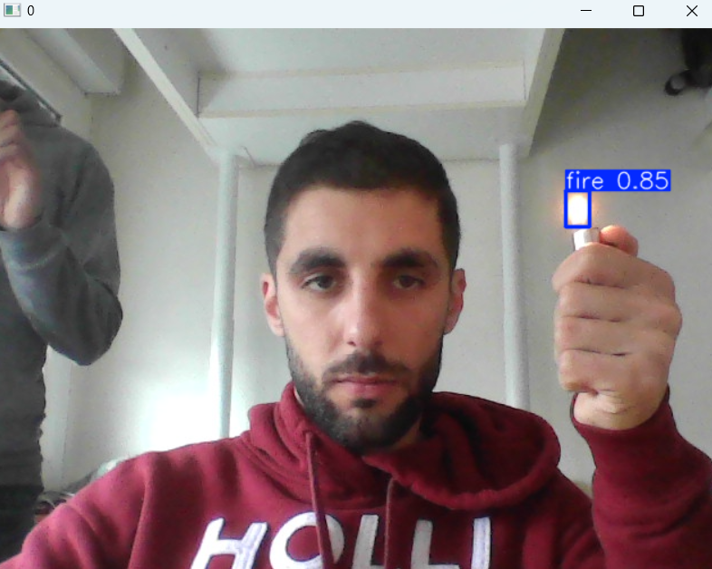

# Projet de Détection d'Objets avec YOLOv8

Ce projet utilise le modèle YOLOv8 d'Ultralytics pour entraîner un modèle de détection d'objets sur un ensemble de données téléchargé depuis Roboflow. 
L'objectif est de détecter des incendies continus à partir d'images ou vidéos (inclus caméra pc).

#Entraînement du Modèle sur Google Colab

Pour entraîner le modèle sur Google Colab :

1. Ouvrez un nouveau notebook Colab et sélectionnez un environnement d'exécution avec GPU. Vous pouvez le faire en allant dans Runtime > Change runtime type et en sélectionnant GPU.

2. Importez le fichier model.ipynb

3. Remplacez "Ccf1ftXKBA81QSiF3OhD" par votre propre clé API Roboflow.
   
4. Changez les paths de train et valid dans le fichier 'data.yaml'
   
5.  runez le code

# Test Local

Après avoir entraîné votre modèle sur Colab, vous pouvez tester le modèle localement sur vos propres images ou vidéos. Voici comment procéder :

1. Téléchargez le meilleur modèle à partir de Colab vers votre machine locale. Le meilleur modèle est généralement situé dans 'runs/detect/train/weights/best.pt'.

2. Installez les dépendances locales :

```bash
pip install ultralytics
pip install roboflow
```
3. Runez le code fireDetection et changez le path de votre vidéo


# Captures

**Caméra**



**Vidéo**
<video width="400" controls>
  <source src="outputfire.mp4" type="video/mp4">
</video>
